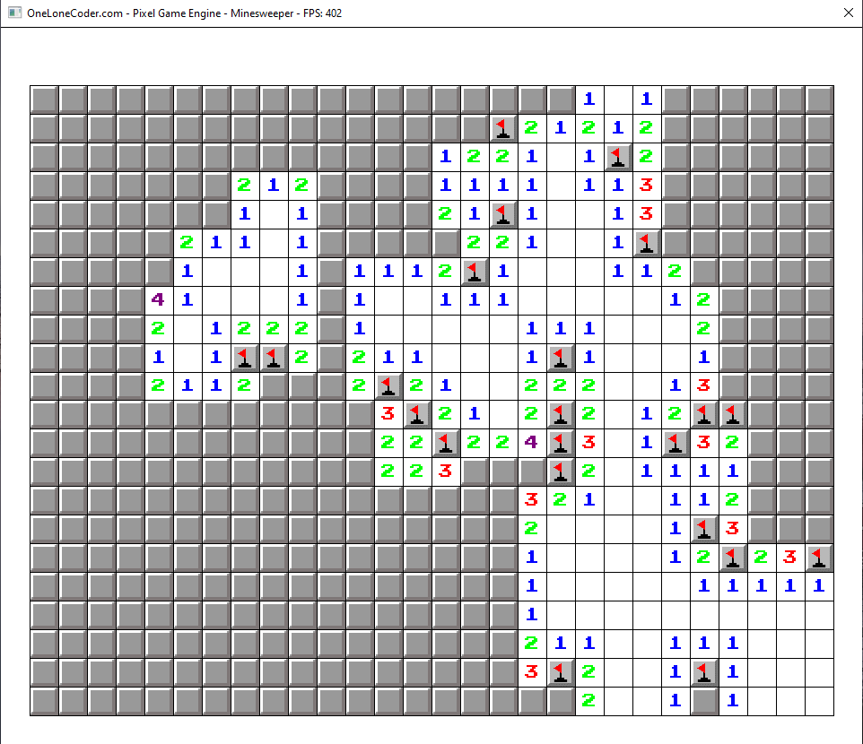
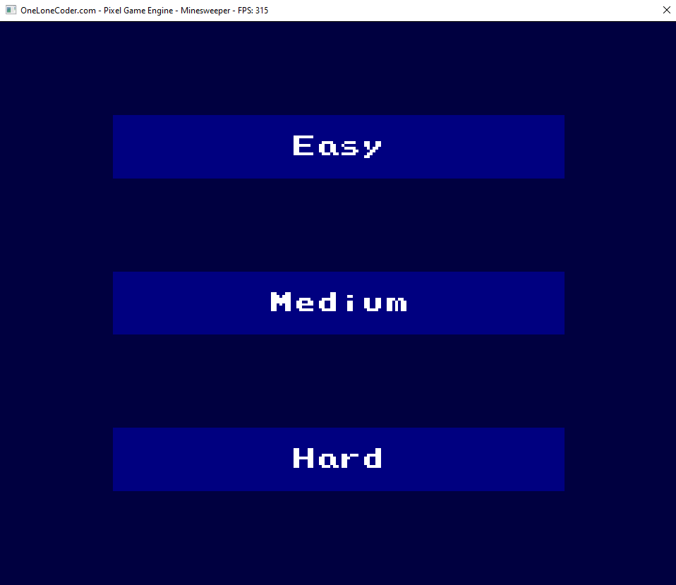
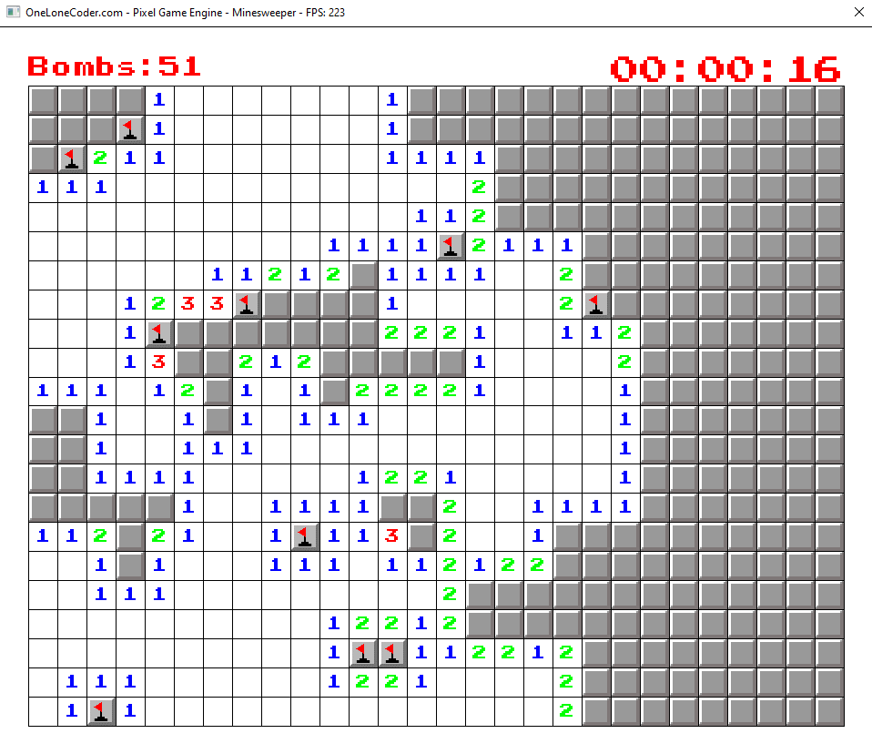

# Minesweeper-in-C++

About
----------------------------------------------------------------------
This is a small project I started in first year in 2019 after learning C++.  Over the past few years I have updated and redone the code to make it cleaner and more readable. I used the olcPixelGameEngine as I only needed something lightweight and quick.

Versions
----------------------------------------------------------------------
The master branch is very basic as I wanted to keep the code clean.  The experimental branch is more feature rich containing things that the master lacks such as a menu, timer, and game over screens.

The master version plays like a classic game of Minesweeper. Allowing you to flag and dig tiles with a mouse.  A number of tiles contain a bomb which are randomly placed, so you can't just 
memorize locations of the bombs.  The master version doesn't check for if a game is won or lost.  

In the experimental verison, I decided to test out making a menu, which contains buttons that change colour when hovered over, along with testing when a game is lost, so there are actually
repercussions for clicking on a bomb. In the event of this and game over sceen will show up and the game will have to be re-started.

There is also a clock at the top right, and a counter for the amount of tiles are flagged.

Key Bindings
----------------------------------------------------------------------
Mouse 0: dig
Mouse 1: flag
Esc: reset board

How to Run
----------------------------------------------------------------------
1. Clone repository
2. Open solution in Visual Studio
3. Build solution
4. Run executable

Resources
----------------------------------------------------------------------
https://github.com/OneLoneCoder/olcPixelGameEngine
